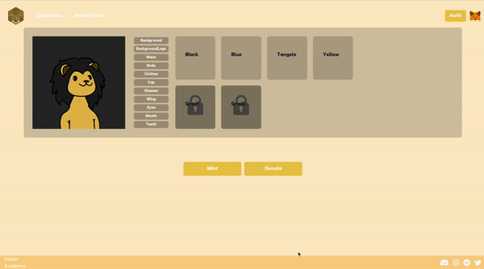

    

# AslanAcademy NFT

**블록체인학회 "아슬란 아카데미" NFT 프로젝트**
블록체인 학회인 아슬란 아카데미 학회원들을 위한 블록체인 프로젝트입니다.
따로 비용이 들지 않고 모든 학회원과 학회 구성원들이 부담없이 참여가 가능하며 아슬란 학회를 증명할 수 있는 PFP NFT를 발급 받아 보세요!

 

## Table of Contents

- [개요](#개요)
- [Skills](#skills)
- [API Reference](#api-reference)
- [프로젝트 설계 및 구조](#프로젝트-설계-및-구조)
- [ERD](#erd)
- [구현과정(설계 및 의도)](<#구현과정(설계-및-의도)>)
- [민팅 방법](#민팅-방법)
- [TIL 및 회고](#til-및-회고)
- [Authors](#authors)

 

## 개요

`Aslan Academy`는 `블록체인`에 관심이 있는 사람들이 모여 관심 있는 분야를 같이 공부하고 학습하는 블록체인 `연구 및 커뮤니티 운영` 단체입니다. 블록체인 스쿨을 수강하며 처음 팀원들에게 아이디어를 제안하며 시작하게 되었고, 팀원들과 함께 천천히, 하지만 단단하게 기반을 다지며 나아가고 있습니다.

아슬란 아카데미 `NFT 프로젝트`는 `“블록체인 기술과 정보의 대중화”`라는 아슬란의 방향성에 맞게 시작한 첫 번째 프로젝트입니다. 아슬란 커뮤니티 참여자가 개인의 NFT를 발급함으로 학회의 소속함을 느낄 수 있을 뿐만 아니라 블록체인 업계에서 가장 대중적인 NFT 민팅을 `체험`할 수 있습니다.

또한, 일반적인 NFT 민팅과 차별성을 두어 유저가 직접 NFT를 `커스터마이징`할 수 있습니다. 이때 유저가 커스터마이징한 조합들을 기억해 `중복`된 커스텀을 민팅 전에 `방지`합니다. 이로써 유저들은 자신만의 `특별`하고 `유니크`한 NFT를 직접 민팅할 수 있습니다.
 

## Skills

BackEnd            
FrontEnd             
WEB3       
DB   
Deploy        

 

## API Reference

 

## 프로젝트 설계 및 구조

 

## ERD

 

## 구현과정(설계 및 의도)

지갑 로그인 - click

- 일반적인 ID/PW 방식과 다르게 사이트에서 메타마스크로 로그인합니다. 
- 메타마스크 로그인 후 DB에서 유저를 조회 후 없을시 에러를 반환합니다. 
- 유저를 등록하려면 디스코드 인증을 완료해야하고 디스코드 인증까지 완료되면 JWT를 발급받습니다.(로그인 시 DB에서 유저 정보를 찾는 경우 토큰이 발급됩니다) 
- 이후 모든 API 요청은 토큰 검증 후 이루어집니다.

디스코드 인증 - click

- 메타마스크로 로그인된 상태에서 아슬란 아카데미 디스코드 채널에 소속되어 있는 유저인지 인증하는 과정입니다. 이 과정을 검증 후 유저 등록이 됩니다. 유저는 메타마스크 로그인이 된 상태에서 유저의 디스코드 사용자명을 입력해 서버로 요청합니다. 서버에서 디스코드 API를 통해 아슬란 아카데미 기스코드 채널에 속한 유저인지 확인 후 있으면 DB에 저장 후 토큰을 발급합니다. 
  

민팅 조합 -click

- 유저는 아바타의 옷꾸미기처럼 자신만의 NFT의 파츠를 골라 제작할 수 있습니다. 이 때 이미 다른 유저가 민팅한 조합인 경우는 민팅이 불가능하며 민팅의 조합은 각 파츠 부위별로 자리수가 지정되어 11자리의 배열값이 만들어집니다. 이 조합값으로 서버에서 중복 조회를 하게 됩니다. 

Cloud -click

- AWS EC2에 서버 컨테이너, DB 컨테이너 실행 후 docker-compose를 통해 컨테이너끼리의 연결 후 가동하려 했으나 EC2 프리티어 메모리 용량 문제로 RDS로 DB를 생성했습니다. 

- 서버 도메인을 따로 구입하지 않고 Caddyd의 reverse_proxy를 통해 HTTPS 서빙하였습니다.

 

## 민팅 방법
**로그인**
   
**기부**
   
**민팅**
  

## TIL 및 회고

- [도메인 없이 htpps 적용하기](https://generated-cheddar-8e9.notion.site/htpps-d451a30ce9aa42c09674519ffe93855f?pvs=4)
- [RDS 외부 접속](https://generated-cheddar-8e9.notion.site/RDS-ece695d50cab4f95aaed012bc3b201a3?pvs=4)

 

## Authors

 

<a href="https://github.com/keeepmin94">유지민</a>

 
